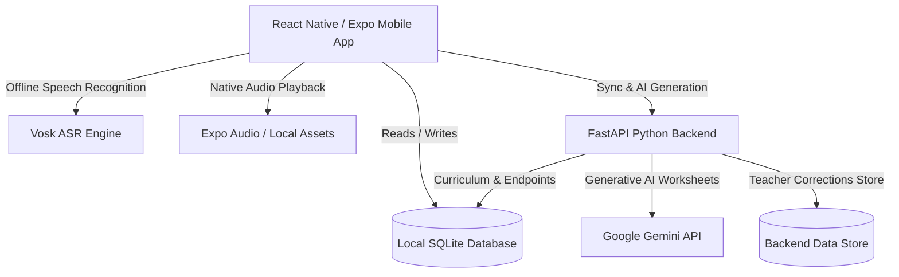

# ShikshaSetu (शिक्षा सेतु) 🌉📚

> **Multilingual Educator Bridge & Offline Primary LMS**  
> *Developed by Team Stark Dynamics for Smart India Hackathon (SIH) 2026*

---

## 🌟 Overview

**ShikshaSetu** is an offline-first mobile application and AI microservice ecosystem engineered to bridge language barriers in primary school classrooms (Classes 1–3) across tribal and multilingual belts of India. 

Many young learners entering primary school speak regional or tribal mother tongues such as **Santali (written in the Ol Chiki ᱚᱞ ᱪᱤᱠᱤ script)**, while state curriculums and instruction are often conducted in Hindi or English. ShikshaSetu empowers educators with:
- **Offline Bilingual Curriculum & Interactive Worksheets** (English, Hindi, and Santali with native audio playback).
- **On-Device Voice AI Assistant** (Push-to-talk speech recognition in Hindi via Vosk ASR translated into Santali with teacher review and audio generation).
- **Classroom Phrasebook** for instant teacher-student communication.
- **AI-Powered Bilingual Worksheet Generator** leveraging Google Gemini and curated Foundational Literacy and Numeracy (FLN) templates.
- **Offline SQLite Database & Background Sync** to ensure 100% classroom uptime without internet dependencies.

---

## 📸 Core Features

### 1. 📚 Curriculum & Bilingual Worksheets
- Full curriculum for **Class 1, Class 2, and Class 3** across Mathematics, Language, and Environmental Studies / Science.
- Side-by-side view of lessons in **English and Santali (Ol Chiki)** with Romanized pronunciations.
- Line-by-line and chapter-level **synchronized native audio playback**.

### 2. 🎤 Classroom Voice Assistant (ASR + NMT + TTS)
- **Push-to-hold speech recognition** in Hindi powered by on-device Vosk offline models.
- Automatic neural/dictionary translation to Santali with confidence metrics.
- **Teacher Review & Inline Editing**: Allows educators to review, edit, and fine-tune translations before playing audio aloud to students.
- **Continuous Learning**: Saves teacher corrections into an offline queue that syncs back to the server for dataset refinement.

### 3. 💬 Teacher's Classroom Management Phrasebook
- 16+ essential everyday classroom phrases grouped into:
  - 🌅 Greetings & Attendance
  - 🤫 Discipline & Classroom Order
  - 📝 Blackboard & Notebook Instructions
  - 🌟 Encouragement & Motivation
- Instant one-tap native audio pronunciation playback.

### 4. 🤖 AI Bilingual Worksheet Generator
- Generates interactive, level-appropriate worksheets for Classes 1–3 on any selected topic.
- Powered by Google Gemini 2.5 API with automatic fallback to curated FLN worksheets when offline.
- Dual-column format featuring English questions and corresponding Ol Chiki Santali translations.

### 5. 🛡️ Offline-First Architecture & Cloud Synchronization
- Fully functional without an active internet connection using local SQLite (`expo-sqlite`).
- Periodic and manual synchronization with the FastAPI cloud backend to update syllabus records and upload teacher corrections.

---

## 🏗️ Architecture & Technology Stack



### Mobile App (Frontend)
- **Framework**: React Native 0.86, Expo SDK 57 (Development Client)
- **Language**: TypeScript
- **Styling**: NativeWind (Tailwind CSS v3) & Custom Design System
- **Navigation**: React Navigation v7 (Native Stack)
- **Offline Database**: `expo-sqlite`
- **Audio Engine**: `expo-audio`, `expo-asset`
- **Offline Speech-to-Text**: `react-native-vosk` (Hindi offline model `model-hi-in`)
- **Animations**: `react-native-reanimated`

### Backend Microservice
- **Framework**: FastAPI (Python 3.10+)
- **Server**: Uvicorn (ASGI)
- **AI / LLM Integration**: Google Gemini API via `google-genai` / REST
- **Validation**: Pydantic v2
- **Data & Configuration**: Dotenv, CORS Middleware

---

## 📂 Project Structure

```
ShikshaSetu/
├── android/                     # Android native project configuration
├── assets/                      # App icons, splash screens, and audio clips
│   ├── audio/                   # Pre-recorded audio assets (.wav, .mp3)
│   └── model-hi-in/             # Vosk offline Hindi ASR model bundle
├── backend/                     # FastAPI backend microservice
│   ├── .env                     # Backend environment configuration
│   ├── data.py                  # Static syllabus & voice scenario seeds
│   ├── main.py                  # API endpoints, sync, and Gemini generator
│   ├── README.md                # Backend specific documentation
│   └── requirements.txt         # Python dependencies
├── src/
│   ├── assets/                  # Frontend bundled asset mappings
│   ├── components/              # Modular UI components (cards, audio controls)
│   ├── data/                    # Local seed data (phrasebook, syllabus JSONs)
│   │   ├── phrasebook.json      # Classroom phrasebook definitions
│   │   └── syllabus/            # Class 1-3 curriculum JSON files
│   ├── hooks/                   # Custom React hooks
│   ├── navigation/              # AppNavigator and navigation type definitions
│   ├── screens/                 # Application screen views
│   │   ├── HomeScreen.tsx
│   │   ├── ClassSelectionScreen.tsx
│   │   ├── SubjectSelectionScreen.tsx
│   │   ├── ChapterListScreen.tsx
│   │   ├── LessonContentScreen.tsx
│   │   ├── VoiceAssistantScreen.tsx
│   │   ├── TranslationResultScreen.tsx
│   │   ├── PhrasebookScreen.tsx
│   │   ├── GenerateWorksheetScreen.tsx
│   │   └── SettingsScreen.tsx
│   ├── services/                # Business logic, database, sync, & voice pipeline
│   │   ├── api.ts               # HTTP client with Axios
│   │   ├── audioPlayer.ts       # Sound playback wrapper
│   │   ├── database.ts          # SQLite database schema and operations
│   │   ├── syllabusService.ts   # Syllabus data provider
│   │   ├── syncService.ts       # Background server sync & correction queue
│   │   └── voicePipeline/       # Modular STT, Translator, and TTS pipeline
│   └── types/                   # Shared TypeScript interfaces
├── .env                         # Root app environment variables
├── app.json                     # Expo configuration and native plugins
├── package.json                 # Node dependencies and scripts
├── tailwind.config.js           # NativeWind / Tailwind setup
└── tsconfig.json                # TypeScript compiler configuration
```

---

## 🚀 Getting Started

### Prerequisites
- **Node.js**: v18.x or later
- **npm** or **yarn**
- **Python**: v3.10 or later (for backend)
- **Android Studio & SDK** (for building Android APK / running Emulator)
- **Expo CLI** (`npm install -g expo-cli`)

---

### 1. Mobile App Setup & Execution

1. **Clone the repository**:
   ```bash
   git clone https://github.com/pavan201806/ShiksaSetu.git
   cd ShiksaSetu
   ```

2. **Install JavaScript dependencies**:
   ```bash
   npm install
   ```

3. **Configure Environment Variables**:
   Create or edit `.env` in the root directory:
   ```env
   EXPO_PUBLIC_API_URL=http://<YOUR_LOCAL_IP_OR_SERVER>:8000
   ```
   *(Note: If running on a physical Android device or emulator, use your machine's LAN IP address or the deployed cloud backend URL).*

4. **Run the App**:
   - **For Development Client (Android with Vosk Native Module)**:
     ```bash
     npx expo run:android
     ```
   - **For Expo Dev Server**:
     ```bash
     npx expo start
     ```

---

### 2. Backend Server Setup & Execution

1. **Navigate to the `backend/` directory**:
   ```bash
   cd backend
   ```

2. **Create and activate a virtual environment**:
   ```bash
   # Windows (PowerShell)
   python -m venv venv
   .\venv\Scripts\Activate.ps1

   # Linux / macOS
   python3 -m venv venv
   source venv/bin/activate
   ```

3. **Install Python dependencies**:
   ```bash
   pip install -r requirements.txt
   ```

4. **Configure Backend Environment Variables**:
   Create or edit `backend/.env`:
   ```env
   GEMINI_API_KEY="your-gemini-api-key-here"
   ```

5. **Start the FastAPI server**:
   ```bash
   uvicorn main:app --reload --host 0.0.0.0 --port 8000
   ```

6. **Verify Server Status**:
   - Root Status: [http://localhost:8000/](http://localhost:8000/)
   - Interactive Swagger API Docs: [http://localhost:8000/docs](http://localhost:8000/docs)
   - ReDoc Documentation: [http://localhost:8000/redoc](http://localhost:8000/redoc)

---

## 📡 Backend API Endpoints

| Method | Endpoint | Description |
| :--- | :--- | :--- |
| `GET` | `/` | API Health & status check |
| `GET` | `/syllabus` | Overview of all classes and available subjects |
| `GET` | `/syllabus/{class_id}` | Detailed curriculum, chapters, and lessons for Class 1, 2, or 3 |
| `GET` | `/lesson/{lesson_id}` | Lookup a specific lesson by ID across subjects |
| `POST` | `/voice/process` | Speech processing endpoint (ASR + Translation payload) |
| `GET` | `/voice/demo/{scenario_id}` | Returns pre-seeded voice scenarios for testing |
| `POST` | `/teacher/corrections` | Submits teacher translation corrections batch from mobile app |
| `GET` | `/teacher/corrections` | Retrieves submitted corrections for model fine-tuning |
| `POST` | `/worksheets/generate` | Generates bilingual worksheets using Gemini AI / FLN templates |
| `GET` | `/worksheets` | Retrieves all previously generated worksheets |

---

## 🗣️ Supported Languages & Scripts

| Language | ISO Code | Native Script | Support Level |
| :--- | :--- | :--- | :--- |
| **Santali** | `sat` | Ol Chiki (ᱚᱞ ᱪᱤᱠᱤ) + Romanized | Primary Target (TTS, Worksheets, Phrasebook) |
| **Hindi** | `hi` | Devanagari (हिन्दी) | Source Language (Vosk ASR, Dual Display) |
| **English** | `en` | Latin Script | Medium of Instruction & Baseline Worksheets |

---

## 👥 Contributors & Acknowledgements

Developed with ❤️ by **Team Stark Dynamics** for the **Smart India Hackathon (SIH) 2026**.

- **Organization**: Ministry of Education / Smart India Hackathon
- **Focus Area**: Foundational Literacy & Numeracy (FLN), Multilingual Classroom Inclusion, Tribal Education.

---

## 📄 License

This project is licensed under the [MIT License](file:///f:/SIH/ShiksaSetu/LICENSE).
