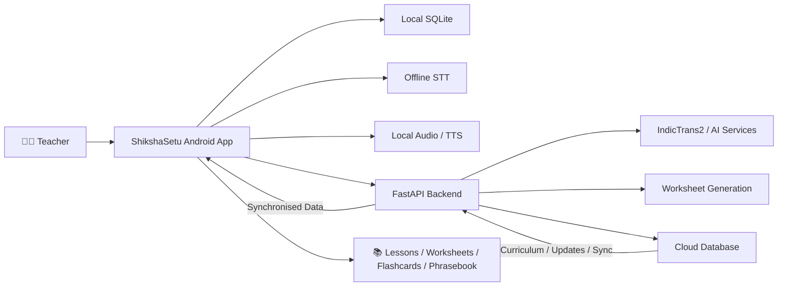

<div align="center">

<picture>
  <source media="(prefers-color-scheme: dark)" srcset="docs/assets/sih-2026-dark.png">
  
</picture>

<br><br>

# ShikshaSetu (शिक्षा सेतु) 🌉📚

**AI-Powered Vernacular Pedagogy & Real-Time Translation for Mother-Tongue Primary Education**<br>
*Bridging Languages | Building Brighter Classrooms*

Smart India Hackathon 2026 · Problem Statement **SIH26042** · Theme **Smart Education**<br>
Team **StarkDynamics** · Team ID **145690** · GMR Institute of Technology

<br>


<br>


</div>

<br>

> **"Others translate words. ShikshaSetu builds lessons — offline, teacher-ready, in Santali."**

---

## 🎯 Problem Statement

**Problem Statement ID:** SIH26042

**Title:** *AI-Powered Vernacular Pedagogy and Real-Time Translation Tool for Mother Tongue-Based Primary Education*

**Theme:** Smart Education  
**Category:** Software

Tribal children often learn best in their mother tongue, while teachers deployed in multilingual classrooms may primarily speak Hindi. This creates a language barrier in tribal primary classrooms, particularly where digital educational tools for languages such as **Ho, Mundari, and Santali** are limited.

ShikshaSetu addresses this challenge through an AI-assisted Android application that enables teachers to access curriculum, communicate through bilingual voice interaction, and generate learning material in **Hindi and Santali**, while keeping core functionality available offline.

---

## 🌟 Overview

**ShikshaSetu** is an **offline-first Android education platform** designed for multilingual primary classrooms.

The current prototype focuses on:

- Hindi ↔ Santali voice translation
- Santali learning content using **Ol Chiki**
- Classes 1–3 curriculum
- Bilingual worksheets
- Flashcards
- Classroom phrasebook
- Teacher-reviewed AI translation
- Offline speech recognition
- Offline audio playback
- Local SQLite storage
- Cloud synchronization when connectivity is available

The solution is designed for **low-connectivity classrooms and low-cost Android devices**, with the technical approach targeting approximately **2 GB RAM** devices.

---

## 🧩 How ShikshaSetu Addresses the Problem

```text
                 TEACHER
                    │
                    │ Hindi Speech
                    ▼
             ┌──────────────┐
             │   Vosk STT   │
             └──────┬───────┘
                    │
                    │ Hindi Text
                    ▼
             ┌──────────────┐
             │ IndicTrans2  │
             └──────┬───────┘
                    │
                    │ Santali Text
                    ▼
             ┌──────────────┐
             │  Teacher     │
             │   Review     │
             └──────┬───────┘
                    │
                    ▼
             ┌──────────────┐
             │ Santali TTS  │
             │ Piper / VITS │
             └──────┬───────┘
                    │
                    ▼
                 STUDENT
              Santali Speech
```

The reverse direction is also part of the solution:

```text
Santali Speech
      ↓
Santali STT
      ↓
Santali Text
      ↓
IndicTrans2
      ↓
Hindi Text
      ↓
Hindi TTS
      ↓
Hindi Speech
```

This creates a **bidirectional Hindi ↔ Santali voice communication pipeline**.

---

## ⚡ Real-Time Voice-to-Voice Translation

The technical approach targets an end-to-end latency of **under 3 seconds**.

The submission reports the following pipeline estimates:

| Direction | Pipeline | Approx. End-to-End Time |
| --- | --- | ---: |
| Hindi → Santali | STT + Translation + TTS | **1.1–1.5 s** |
| Santali → Hindi | STT + Translation + TTS | **1.6–2.3 s** |

The system runs speech processing, translation and synthesis **on-device**, using lightweight/optimised models.

---

## 🧠 AI Model Pipeline

### Speech-to-Text

The prototype uses **Vosk** for offline Hindi speech recognition.

```text
Microphone
    ↓
Audio Capture
    ↓
Vosk STT
    ↓
Hindi / Santali Text
```

### Neural Translation

**IndicTrans2** is used for Hindi ↔ Santali translation.

```text
Hindi Text
    ↕
IndicTrans2
    ↕
Santali Text
```

### Text-to-Speech

The prototype uses offline TTS resources including **Piper / VITS** and fine-tuned voice resources for native-language speech.

```text
Text
 ↓
Text Normalisation
 ↓
Offline TTS
 ↓
Native Speech
```

---

## 📚 Core Features

### 1. Curriculum & Bilingual Learning

The application provides curriculum content for:

- **Class 1**
- **Class 2**
- **Class 3**

Across subjects including:

- Mathematics
- Language
- Environmental Studies / Science

Learning content can be presented in bilingual form, including **English and Santali (Ol Chiki)** with Romanized pronunciation support.

---

### 2. 🎤 Classroom Voice Assistant

Teachers can use push-to-talk voice interaction for classroom communication.

Features include:

- Offline speech recognition
- Hindi → Santali translation
- Santali → Hindi translation architecture
- Teacher review before playback
- Native-language audio generation/playback
- Offline correction queue

```text
Teacher
  │
  ▼
Speech
  │
  ▼
Offline STT
  │
  ▼
Translation
  │
  ▼
Teacher Review
  │
  ▼
TTS
  │
  ▼
Student
```

---

### 3. 💬 Classroom Phrasebook

The classroom phrasebook provides commonly used teacher-student expressions.

The prototype includes **16+ classroom phrases** covering areas such as:

- Greetings & Attendance
- Discipline & Classroom Order
- Blackboard & Notebook Instructions
- Encouragement & Motivation

Each phrase can be played using native audio.

---

### 4. 🤖 AI Bilingual Worksheet Generator

ShikshaSetu can generate curriculum-oriented worksheets for primary classes.

The system combines:

- Google Gemini
- Curated FLN templates
- Bilingual question generation
- Santali translation
- Teacher-oriented learning material

When the online AI service is unavailable, curated content can continue to support the offline experience.

---

### 5. 📴 Offline-First Learning

Core learning resources are stored locally so that classroom functionality does not depend on continuous internet connectivity.

```text
             SHIKSHASETU
                  │
      ┌───────────┼───────────┐
      ▼           ▼           ▼
  Curriculum   Voice       Audio
      │        Pipeline      │
      └───────────┼───────────┘
                  ▼
             SQLite DB
                  │
             When Online
                  ▼
           FastAPI Backend
                  │
       ┌──────────┼──────────┐
       ▼          ▼          ▼
   Curriculum   Sync      Analytics
```

---

## 🏗️ System Architecture



---

## 🔄 Offline + Online Architecture

ShikshaSetu separates **classroom operation** from **cloud synchronization**.

### Offline Mode

The application can work with:

- Cached lessons
- Local curriculum
- Worksheets
- Flashcards
- Phrasebook
- Local database
- On-device AI models
- Local audio resources

### Online Mode

When connectivity becomes available:

```text
Local Database
      │
      │ Sync
      ▼
Cloud Database
      │
      ├── Curriculum Updates
      ├── New Learning Content
      ├── Teacher Corrections
      └── Analytics
```

This allows the application to remain useful in low-connectivity classrooms while still supporting centralized content management.

---

## 💾 Low-Resource AI & Memory Optimisation

A major design constraint is operation on **low-end Android hardware**, targeting approximately **2 GB RAM**.

The technical approach includes:

- Quantized / optimised ONNX models
- Dynamic model loading
- Load-on-demand AI resources
- Local inference
- Memory-aware model management
- Lightweight mobile application architecture

The technical evaluation presented for the solution includes model memory measurements across the STT, translation and TTS pipeline.

---

## 🛠️ Technology Stack

### Mobile Application

| Component | Technology |
| --- | --- |
| Framework | React Native |
| Runtime | Expo SDK |
| Language | TypeScript |
| Styling | NativeWind / Tailwind CSS |
| Navigation | React Navigation |
| Local Database | SQLite / expo-sqlite |
| Audio | Expo Audio / local assets |
| Offline ASR | Vosk |
| AI Runtime | ONNX Runtime |

### AI / ML

| Component | Technology |
| --- | --- |
| Speech-to-Text | Vosk / Indic speech models |
| Translation | IndicTrans2 |
| Text-to-Speech | Piper / VITS |
| Model Optimisation | Quantization / ONNX |
| Worksheet Generation | Google Gemini + curated FLN templates |

### Backend

| Component | Technology |
| --- | --- |
| Framework | FastAPI |
| Language | Python |
| Server | Uvicorn |
| Validation | Pydantic |
| AI Integration | Google Gemini |
| Database / Storage | Backend data store |
| Sync | REST API |

---

## 📂 Project Structure

```text
ShikshaSetu/
│
├── android/                       # Android native configuration
│
├── assets/                        # App assets and AI resources
│   ├── audio/                     # Audio assets
│   └── model-hi-in/               # Vosk Hindi ASR model
│
├── backend/                       # FastAPI backend
│   ├── data.py                    # Curriculum / scenario data
│   ├── main.py                    # API endpoints and AI services
│   ├── README.md                  # Backend documentation
│   └── requirements.txt           # Python dependencies
│
├── src/
│   ├── assets/                    # Frontend assets
│   ├── components/                # Reusable UI components
│   ├── data/                      # Local seed data
│   │   ├── phrasebook.json
│   │   └── syllabus/
│   ├── hooks/                     # Custom hooks
│   ├── navigation/                # Navigation
│   ├── screens/                   # Application screens
│   ├── services/                  # Business logic and data services
│   │   └── voicePipeline/         # STT / translation / TTS
│   └── types/                     # Shared TypeScript types
│
├── app.json                       # Expo configuration
├── package.json                   # Node dependencies
├── tailwind.config.js             # NativeWind configuration
└── tsconfig.json                  # TypeScript configuration
```

---

## 📱 Application Flow

```text
Splash
  ↓
Home / Dashboard
  ↓
Class Selection
  ↓
Subject Selection
  ↓
Chapter / Lesson List
  ↓
Lesson Content
  ↓
Bilingual Learning
  ↓
Audio / Voice Assistant
  ↓
Worksheets / Flashcards / Phrasebook
```

---

## 🗣️ Supported Languages

| Language | Script | Role |
| --- | --- | --- |
| **Santali** | Ol Chiki + Romanized | Primary target language |
| **Hindi** | Devanagari | Source / teaching language |
| **English** | Latin | Curriculum / baseline content |

> The current prototype focuses on **Hindi ↔ Santali**, with English used for curriculum and learning content.

---

## 🔌 Backend API

| Method | Endpoint | Description |
| --- | --- | --- |
| `GET` | `/` | API health and status |
| `GET` | `/syllabus` | Classes and subjects |
| `GET` | `/syllabus/{class_id}` | Curriculum for a class |
| `GET` | `/lesson/{lesson_id}` | Lesson lookup |
| `POST` | `/voice/process` | Speech processing |
| `GET` | `/voice/demo/{scenario_id}` | Voice demo scenario |
| `POST` | `/teacher/corrections` | Submit teacher corrections |
| `GET` | `/teacher/corrections` | Retrieve corrections |
| `POST` | `/worksheets/generate` | Generate worksheets |
| `GET` | `/worksheets` | Retrieve worksheets |

---

## 🚀 Getting Started

### Prerequisites

- Node.js v18+
- npm or yarn
- Python 3.10+
- Android Studio
- Android SDK
- Expo development environment

### Clone

```bash
git clone https://github.com/pavan201806/ShiksaSetu.git
cd ShiksaSetu
```

### Install Mobile Dependencies

```bash
npm install
```

### Configure Mobile Environment

Create `.env`:

```env
EXPO_PUBLIC_API_URL=http://<YOUR_LOCAL_IP_OR_SERVER>:8000
```

For a physical Android device, use the development machine's LAN IP address or the deployed backend URL.

### Run Android Development Build

```bash
npx expo run:android
```

Or start the Expo development server:

```bash
npx expo start
```

---

## 🐍 Backend Setup

```bash
cd backend
```

### Windows

```powershell
python -m venv venv
.\venv\Scripts\Activate.ps1
pip install -r requirements.txt
```

### Linux / macOS

```bash
python3 -m venv venv
source venv/bin/activate
pip install -r requirements.txt
```

Configure:

```env
GEMINI_API_KEY="your-gemini-api-key-here"
```

Start FastAPI:

```bash
uvicorn main:app --reload --host 0.0.0.0 --port 8000
```

API documentation:

```text
http://localhost:8000/docs
```

ReDoc:

```text
http://localhost:8000/redoc
```

---

## 📊 Feasibility & Viability

The proposed architecture is designed around:

| Challenge | Approach |
| --- | --- |
| Low-cost Android devices | React Native + lightweight models |
| Large AI models | Quantization + ONNX optimisation |
| No continuous internet | On-device AI + SQLite |
| Hindi ↔ Santali translation | IndicTrans2 |
| Teacher workload | AI-generated learning material |
| Language variation | Domain-specific bilingual data + teacher review |
| Battery constraints | Low-power inference and dynamic loading |
| Deployment cost | Open-source software + low-cost hardware |

---

## 🌱 Impact

ShikshaSetu aims to provide:

### 1. Mother-Tongue Learning

Students can access learning resources in Santali, supporting more inclusive classroom participation.

### 2. Learning Continuity

Core lessons, worksheets, flashcards and language resources remain available in low-connectivity environments.

### 3. Reduced Language Barrier

Hindi-speaking teachers can communicate with Santali-speaking students through the bilingual voice pipeline.

### 4. Faster Lesson Preparation

AI-assisted worksheets and learning materials can reduce manual preparation effort.

### 5. Low-End Device Accessibility

Optimised models and dynamic loading target Android devices with approximately **2 GB RAM**.

### 6. Scalable Education Infrastructure

Cloud synchronization can provide curriculum updates and analytics while preserving offline classroom functionality.

---

## 📈 Future Scope

Potential extensions include:

- Additional tribal and regional Indian languages
- More Santali speech datasets
- Improved bidirectional speech translation
- Fully offline translation models
- Additional native-language TTS voices
- Expanded Class 1–3 curriculum coverage
- More efficient quantization
- Improved dynamic model management
- Broader teacher-correction datasets
- Large-scale classroom deployment and field validation

---

## 🔬 Research & References

The solution is informed by:

- UNESCO — PALASH & Mother Tongue Education
- JEPC — Jharkhand MTB-MLE implementation
- NEP 2020 — Foundational Literacy Guidelines
- Bhashini — National Language Technology Mission
- IndicTrans2 — Low-Resource Translation Research

The project is positioned against existing language and education technologies including:

- Adi-Vaani
- Bhashini
- AI4Bharat
- Sarvam AI

The intended differentiation is the combination of **Santali coverage, Hindi ↔ Santali translation, offline operation, teacher-oriented UI, educational content generation, and NIPUN/PALASH-aligned learning**.

---

## 👥 Team

<div align="center">

### StarkDynamics

**GMR Institute of Technology (GMRIT)**  
Rajam, Andhra Pradesh, India

**Team ID: 145690**

| Role | Member |
| --- | --- |
| Team Leader | **A Pavankumar** |
| Team Member | **Karthikeyan Srinivas** |
| Team Member | **P Bharat Kumar** |
| Team Member | **M Bharath Kumar** |
| Team Member | **K Gunasri** |
| Team Member | **K Kalyani** |

**Smart India Hackathon 2026**

</div>

---

## 📄 License

This project is licensed under the **MIT License**.

See the repository `LICENSE` file for the complete license text.

---

<div align="center">

<br>

**ShikshaSetu — Bridging Languages | Building Brighter Classrooms**

<br>

**Team StarkDynamics · Smart India Hackathon 2026 · GMR Institute of Technology**

</div>
